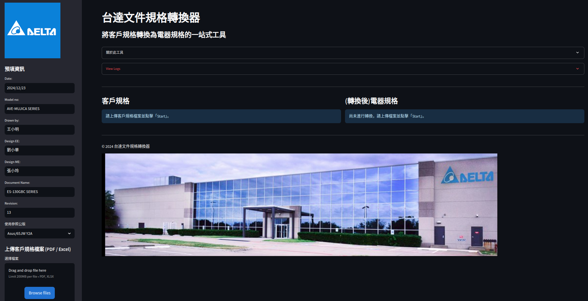

PSBG客戶規格自動轉譯電氣規格

### Usage

#### Testing

1. 建立 `.env`並修改環境變數添加API KEY

   ```
   cp .env_template .env
   ```
2. 修改 `docs_path.py`，註解掉不需要轉譯的檔案路徑
3. 執行 `test.py`

### Evaluation

1. `python eval_retrieval.py --mode create`產生 `retrieval_dataset`
   ```
   retrieval_dataset/
    ├─ 電氣規格檔名1/
    │   └─ 客戶規格檔名1/
    │         └─ query.json, document.json
    ├─ 電氣規格檔名2/
    │   └─ 客戶規格檔名2/
    │         └─ query.json, document.json
   ```
2. 開啟 `retrieval_dataset`下的 `query.json`進行手動標註，將 `documents.json`的id放到 `query.json`的 `retrieval_ground_truth`中
3. `python eval_retrieval.py --mode eval`算出檢索分數

#### Web App

   

```
   streamlit run main.py
```
